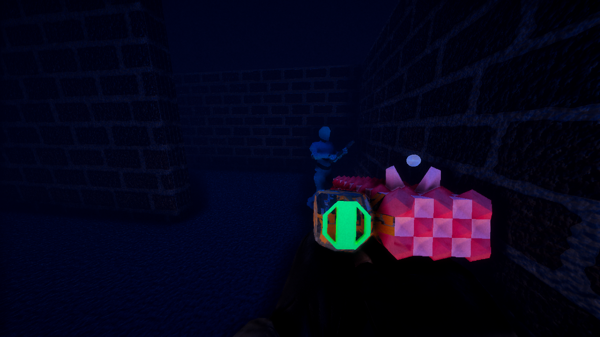
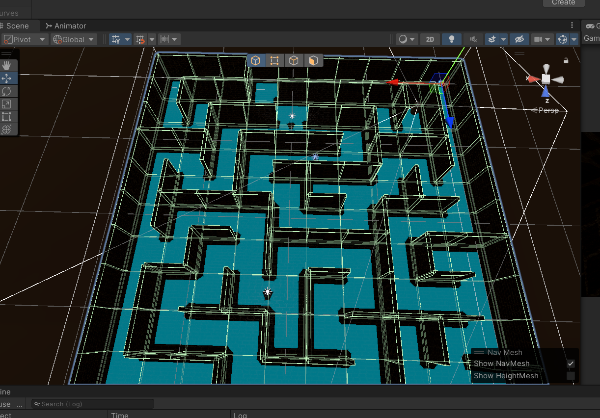
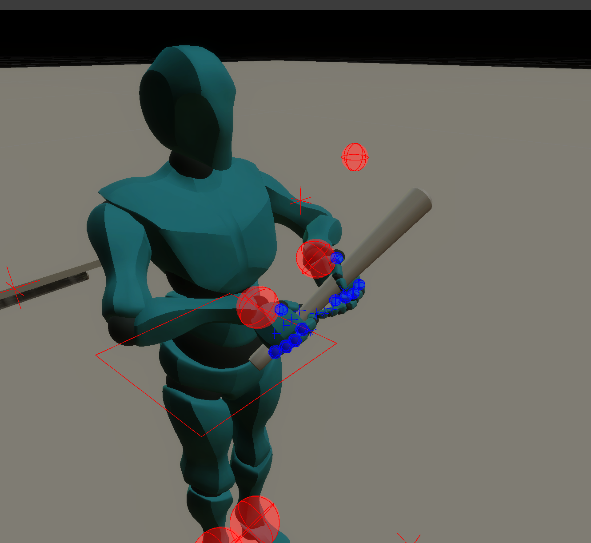
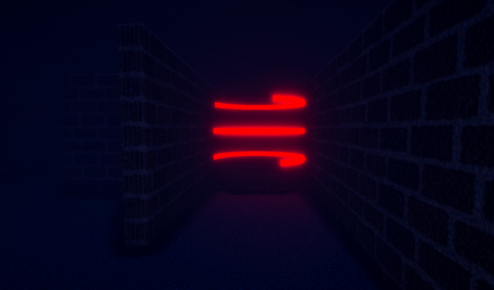
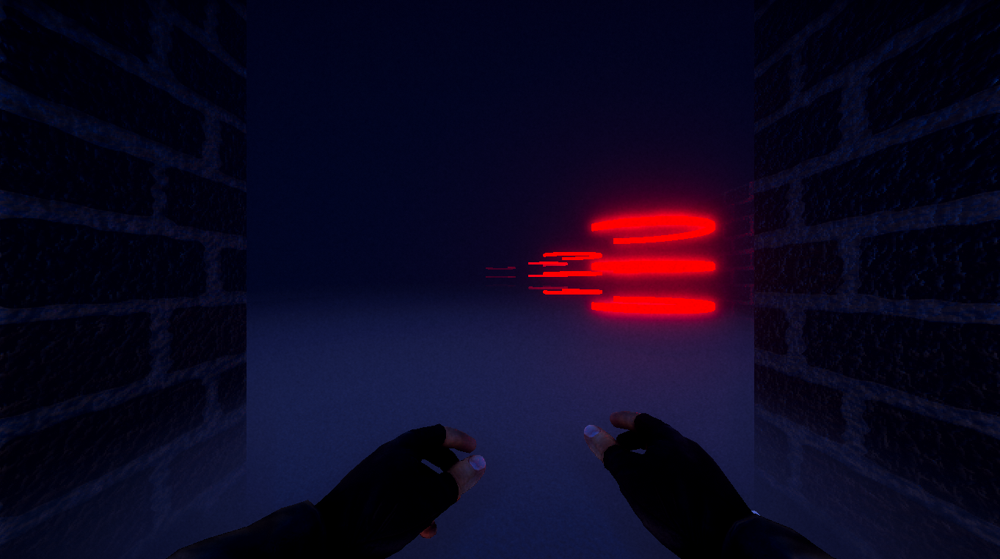

A Demo version for WebGL cannot be created because the project uses HDRP and webgl doesnt support it. An EXE Version is located in Build folder!
# DarkMaze
<video width="960" height="540" controls>
  <source src="blob/Trailer.mp4" type="video/mp4">
</video>

## Game Genre
Survival

## Target Audience
FSK 12

## Game-Engine
Unity

## Controls
- **WASD:** Movement
- **Mouse:** Look around
- **Left Shift:** Sprint
- **Left Mouse Button:** Shoot Weapon
- **Escape:** Pause Menu

## Hints
- If you like horror and suspense, you will enjoy the dark and creepy atmosphere of the game.
- If you like challenges and puzzles, you will have to use your wits and skills to navigate the maze and avoid the enemies.
- If you like action and shooting, you will have to be quick and accurate with your pistol and use the environment to your advantage.
- The teleporters have a timer until they activate, so you have to be careful while waiting for them.

## Description
DarkMaze is a thrilling first person shooter game where you have to survive in a dark and dangerous maze. You start with only a pistol and have to find your way through different levels or randomly generated ones. But beware, the enemies are lurking in the shadows and can sense your presence. If you make any noise, they will hunt you down. One hit and you are dead. Can you master every level and escape the DarkMaze?


### A Random Maze
Here is an example view of a random generated Maze


### Enemies in the Game
This is how the Enemies look like (Asset from [Mixamo](https://www.mixamo.com/))


### Teleporters
There are teleporters in the game that you can use to teleport to another Level. But be careful, they have a timer until they activate, so you have to be careful while waiting for them.


### Save and Load
In the game, you can save your Settings. If the game is started for the first time, the settings are set to default. Settings are automatically loaded when the game is started. The settings are saved when you change anything in the Settings. The settings are saved in JSON format. The settings are saved in the following format:
```json
{
  "volume": 0.5,
  "quality": 2,
  "fullscreen": false,
  "resolution": 0
}
```

### Enviroment Fog
In the game, there is a fog that makes you feel like you are in a dark and dangerous maze. The fog is a post processing effect


## Credits
- **Audio:** 
  - Footsteps: Edited with Audacity, original Audio from [Pixabay - patchytherat](https://pixabay.com/sound-effects/concrete-footsteps-1-6265/)
  - Gun Shots: Edited with Audacity, original Audio from [Pixabay - humanoide9000](https://pixabay.com/sound-effects/sci-fi-gun-shot-x6-14447/)
  - Bat hit: Edited with Audacity, original Audio from [SFXBUZZ - Administrator](https://www.sfxbuzz.com/download/9-cartoon-sound-effects/133-rubber-duck-sound-effect)

- **Models:**
  - Enemy (Y-Bot): Simplified Mesh for Performance, original Model from [Mixamo](https://www.mixamo.com/)
  - PlayerArms: Animated with [Animation Rigging](https://docs.unity3d.com/Packages/com.unity.animation.rigging@1.0/manual/index.html) in Unity, original Model from [Sketchfab - DJMaesen](https://sketchfab.com/3d-models/fps-arms-08ec4403a47645d8ad80633abf13d39d)
  - Weapons: Created with [ProBuilder](https://unity.com/features/probuilder) in Unity.

- **Animations:**
  - All Animations were Created with [Animation Rigging](https://docs.unity3d.com/Packages/com.unity.animation.rigging@1.0/manual/index.html) in Unity.

- **Textures:**
  - Chip-001: Imported from [AmbientCG](https://ambientcg.com/view?id=Chip001)
  - Chip-003: Imported from [AmbientCG](https://ambientcg.com/view?id=Chip003)
  - Chip-004: Imported from [AmbientCG](https://ambientcg.com/view?id=Chip004)
  - Other Textures were imported from [Unity-Technologies/MeasuredMaterialLibraryHDRP](https://github.com/Unity-Technologies/MeasuredMaterialLibraryHDRP)

- **External Unity Assets:**
  - Used [UnityMeshSimplifier](https://github.com/Whinarn/UnityMeshSimplifier) to simplify the Enemy Model for Performance
  - Used [AINavigation](https://docs.unity3d.com/Packages/com.unity.ai.navigation@1.0/manual/index.html) for the Maze [NavmeshSurface](https://docs.unity3d.com/Packages/com.unity.ai.navigation@1.0/manual/NavMeshSurface.html) generation
